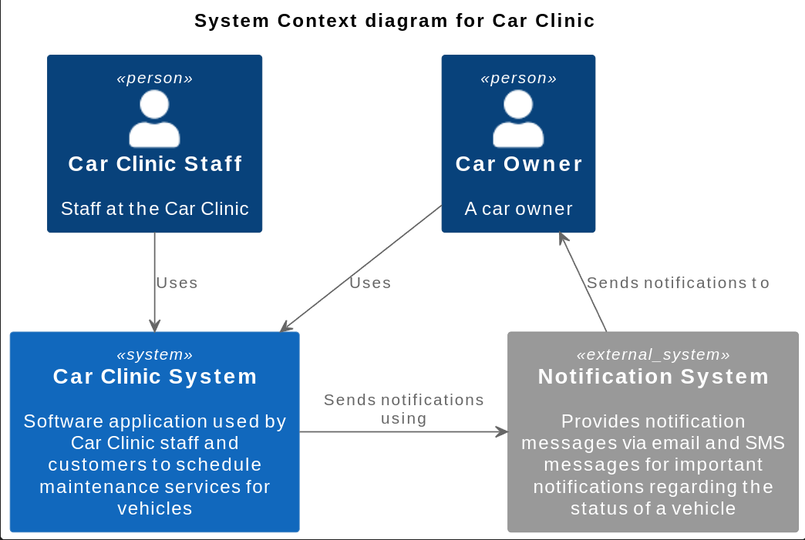
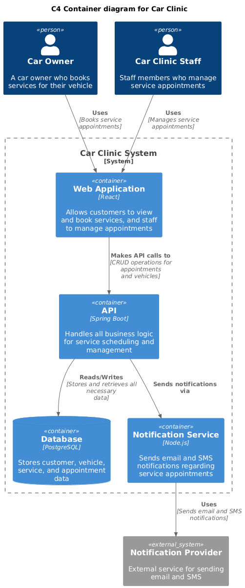
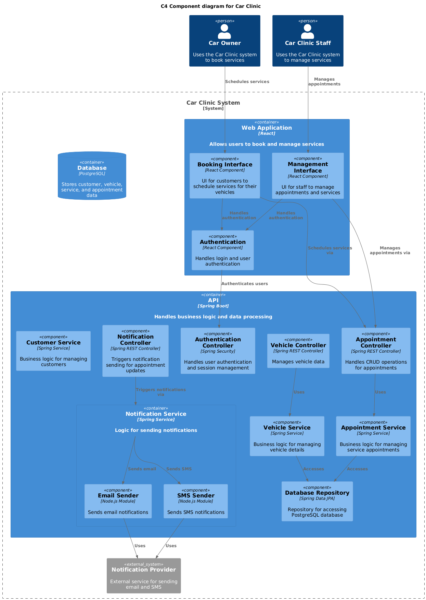
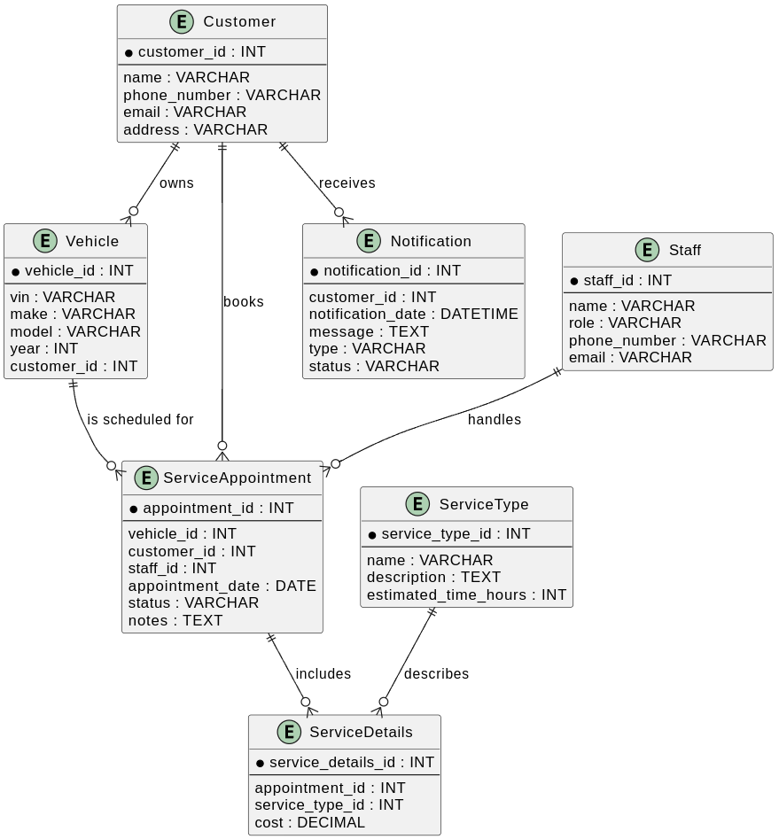

= Car Clinic Application

The Car Clinic application is a software application used by Car Clinic staff and customers to schedule maintenance services for vehicles. The Car Clinic staff use the application to manage appointments and services, order parts from suppliers and update the status of vehicles, while customers use the application to schedule appointments, view service history, and receive notifications about their vehicles.

== System Design

=== System Context Diagram

The System Context diagram for the Car Clinic application shows the relationships between the Car Clinic application and external systems, such as the Notification System.

=== Container Diagram

The Container diagram for the Car Clinic application shows the high-level architecture of the application, including the web application, API, database, and notification service.

=== Component Diagram

The Component diagram for the Car Clinic application shows the components of the web application, API, database, and notification service, including the controllers, services, and repositories used to manage the data and business logic of the application.

=== Entity Relationship Diagram

The Entity Relationship Diagram for the Car Clinic application shows the relationships between the entities in the database, such as Customer, Vehicle, Staff, ServiceAppointment, ServiceType, ServiceDetails, and Notification.

== Backend Development

The backend of the Car Clinic application provides a RESTful API for managing customers, vehicles, staff, service appointments, service types, service details, and notifications. The backend interacts with a PostgreSQL database to store and retrieve data.

=== Technologies Used
- Java
- Spring Boot
- JPA (Java Persistence API)
- PostgreSQL

=== API Endpoints

The following API endpoints are available in the Car Clinic application:
|===
| **Endpoint** | **Method** | **Description**
| /api/customers | POST | Create a new customer
| /api/customers/{id} | GET | Retrieve a customer by ID
| /api/customers/{id} | PUT | Update a customer by ID
| /api/customers/{id} | DELETE | Delete a customer by ID
| /api/vehicles | POST | Create a new vehicle
| /api/vehicles/{id} | GET | Retrieve a vehicle by ID
| /api/vehicles/{id} | PUT | Update a vehicle by ID
| /api/vehicles/{id} | DELETE | Delete a vehicle by ID
| /api/staff | POST | Create a new staff member
| /api/staff/{id} | GET | Retrieve a staff member by ID
| /api/staff/{id} | PUT | Update a staff member by ID
| /api/staff/{id} | DELETE | Delete a staff member by ID
| /api/service-appointments | POST | Create a new service appointment
| /api/service-appointments/{id} | GET | Retrieve a service appointment by ID
| /api/service-appointments/{id} | PUT | Update a service appointment by ID
| /api/service-appointments/{id} | DELETE | Delete a service appointment by ID
| /api/service-types | POST | Create a new service type
| /api/service-types/{id} | GET | Retrieve a service type by ID
| /api/service-types/{id} | PUT | Update a service type by ID
| /api/service-types/{id} | DELETE | Delete a service type by ID
| /api/service-details | POST | Create new service details
| /api/service-details/{id} | GET | Retrieve service details by ID
| /api/service-details/{id} | PUT | Update service details by ID
| /api/service-details/{id} | DELETE | Delete service details by ID
| /api/notifications | POST | Create a new notification
| /api/notifications/{id} | GET | Retrieve a notification by ID
| /api/notifications/{id} | PUT | Update a notification by ID
| /api/notifications/{id} | DELETE | Delete a notification by ID
|===

== Frontend Development

The frontend of the Car Clinic application is built using modern web technologies to provide a responsive and user-friendly interface for customers and staff. The frontend communicates with the backend API to perform CRUD operations on the various entities in the application.

=== Technologies Used
- React
- Tanstack Query
- Axios
- Tailwind CSS

